# Hospital Management Application

A full-stack hospital management system built around three simple ideas: **patients**, **doctors** and **appointments**, with a **patient history** (every visit a patient has had) and a **doctor's patient history** (everyone a doctor has seen). On top of that core it now covers the day-to-day running of a clinic and a small hospital: outpatient queue and triage, visits with vitals and diagnoses, prescriptions, pharmacy stock, lab orders and results, billing with part payments, wards and beds, reports, an audit log and reminders, with a separate home screen and menu for every role.

**Live preview:** https://shishir19999.github.io/Hospital-Management-Application/

The site is called a *live preview* because GitHub Pages is static hosting: it can serve files but cannot run the Node/Express API or MongoDB. The preview therefore runs the very same server code **inside your browser** with sample data in `localStorage`. Everything works (queue, consultations, billing, ...), nothing leaves your device, and *Reset sample data* in the banner starts over. The real application (Express + MongoDB) is what you run with the setup steps below.

> Live preview - runs in your browser with sample data. Changes stay on this device.

## Screenshots

| | |
|---|---|
| 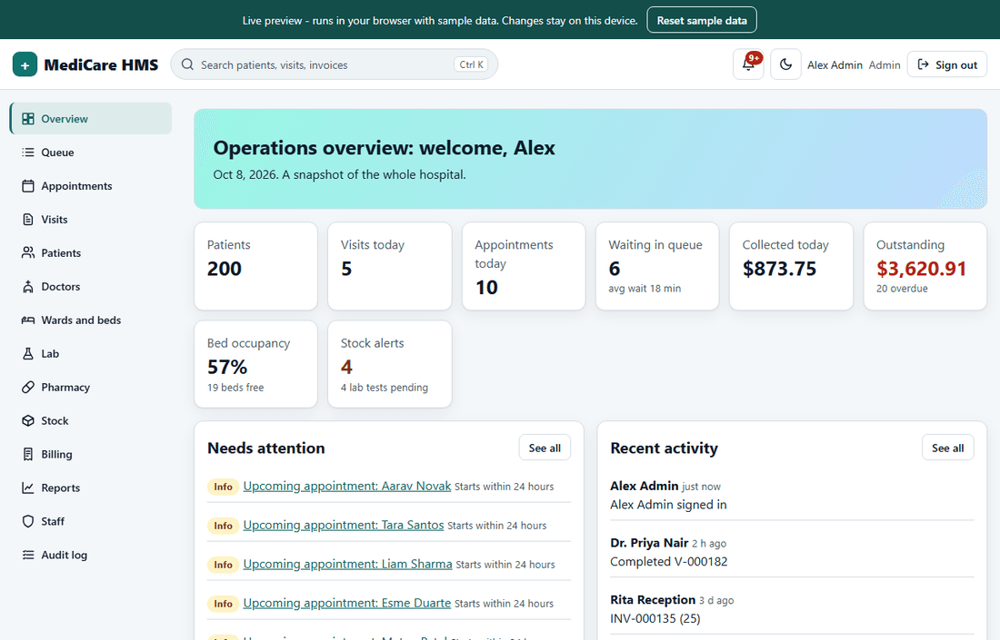 <br> **Admin**: operations overview | 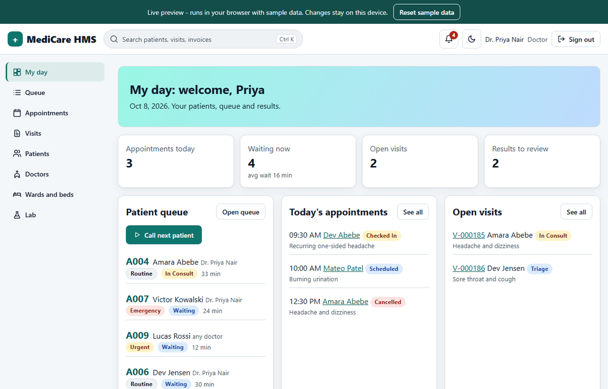 <br> **Doctor**: my day, queue and results |
| 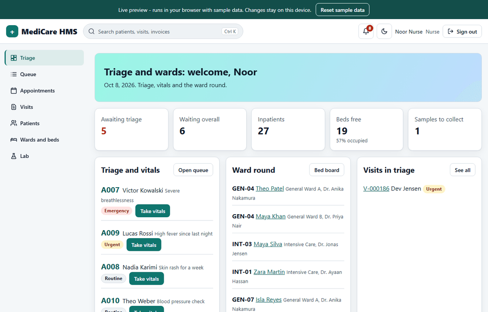 <br> **Nurse**: triage, vitals and ward round | 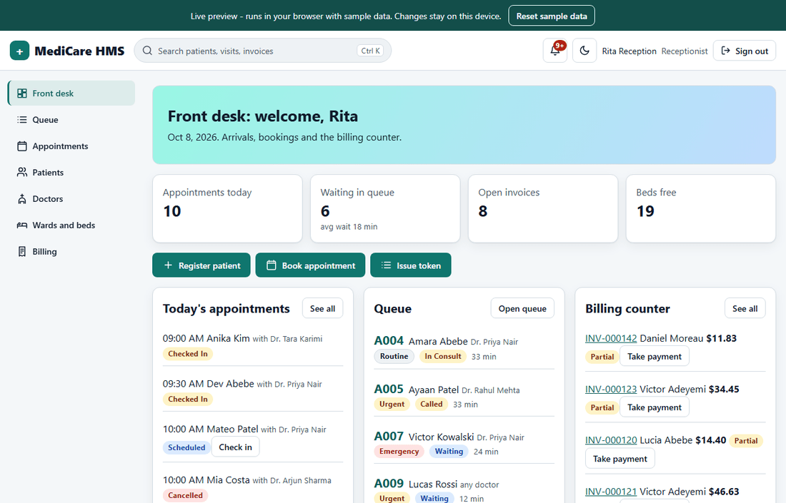 <br> **Receptionist**: front desk and billing counter |
| 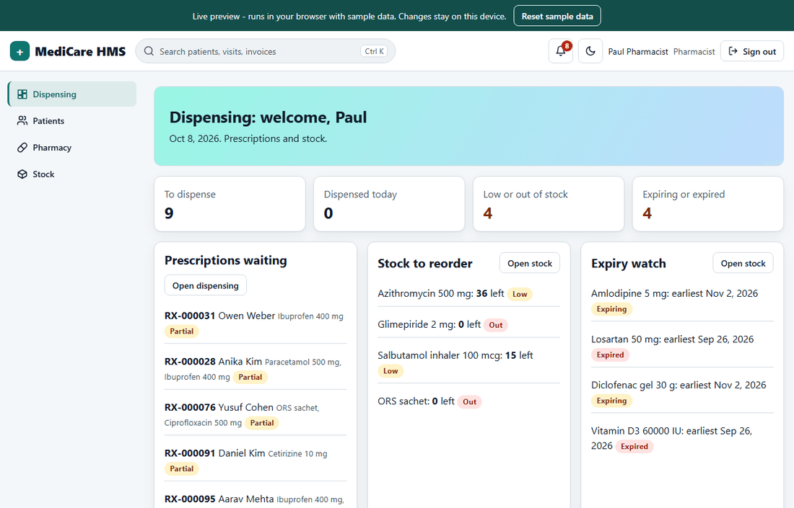 <br> **Pharmacist**: dispensing and stock | 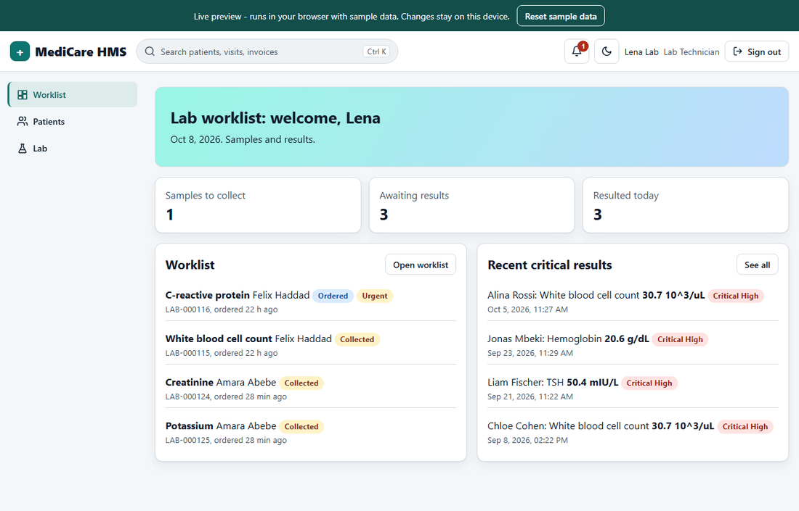 <br> **Lab technician**: worklist and results |
| 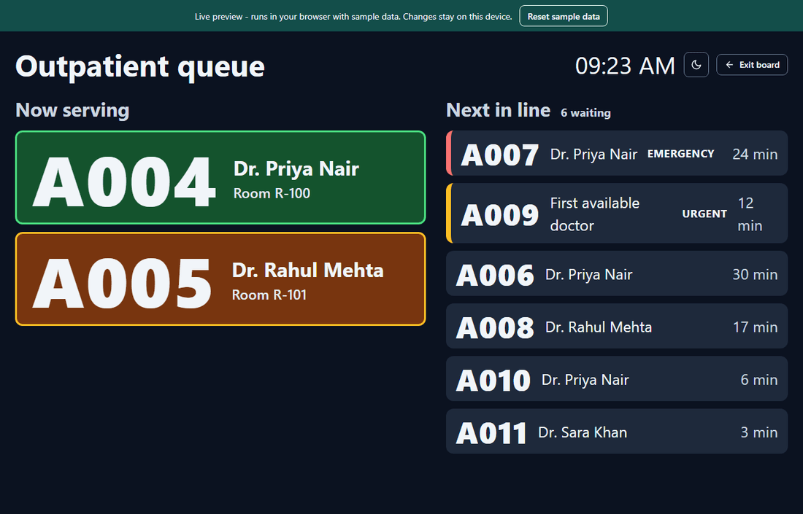 <br> Waiting-room board (large tokens, no names) | 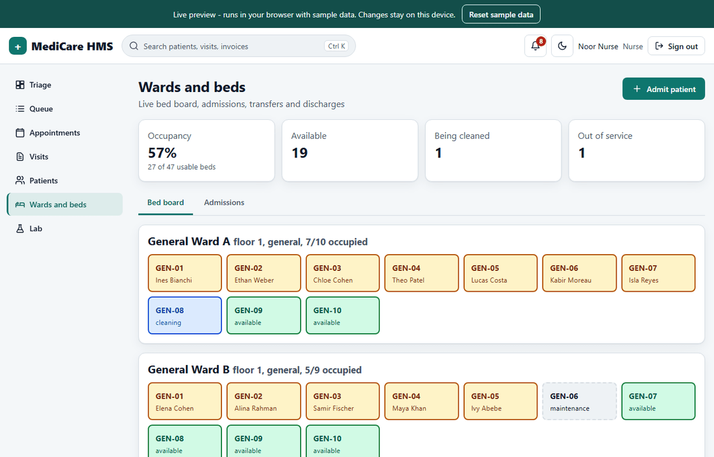 <br> Bed board |
| 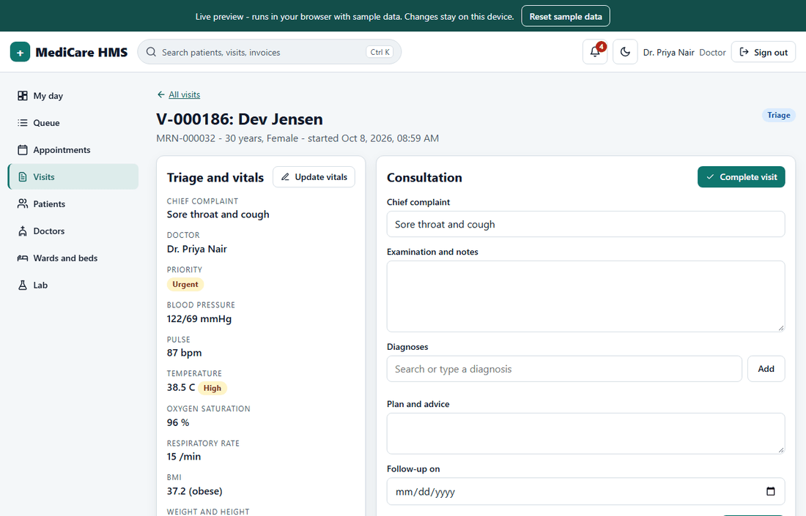 <br> Visit workspace: vitals, notes, prescriptions, labs | 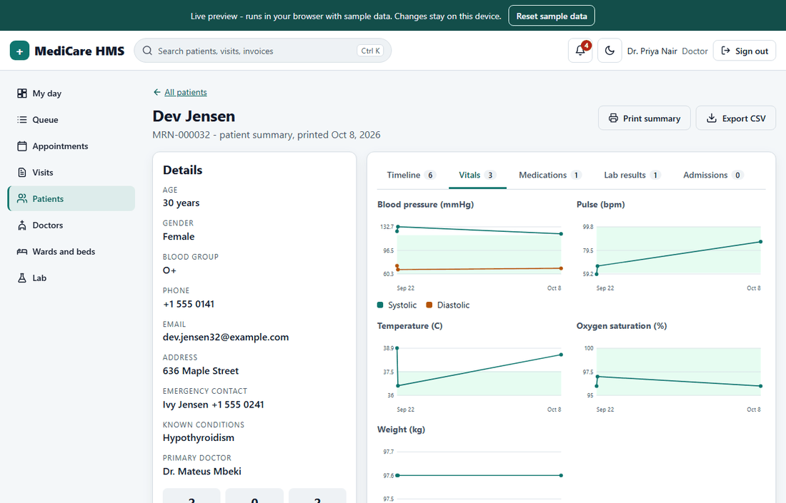 <br> Patient page with vitals charts |
| 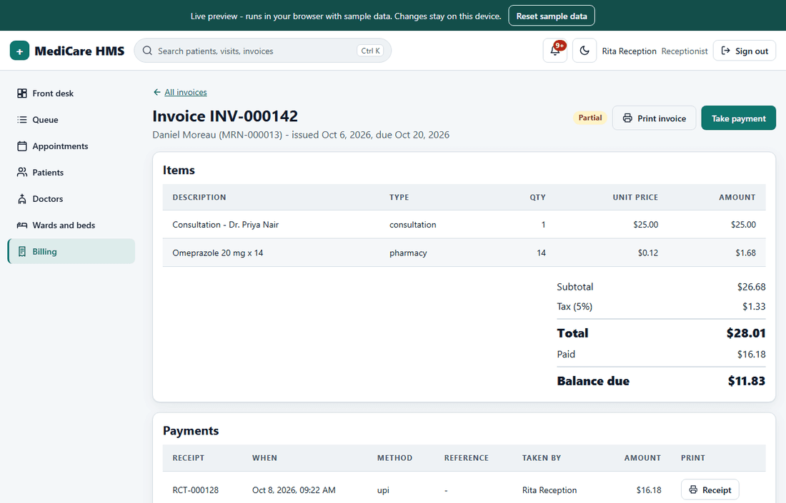 <br> Invoice with payments and receipts | 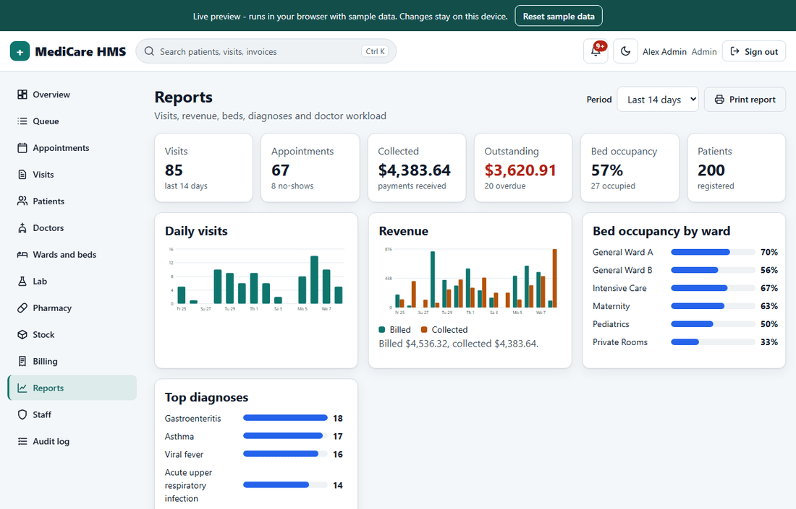 <br> Reports |
| 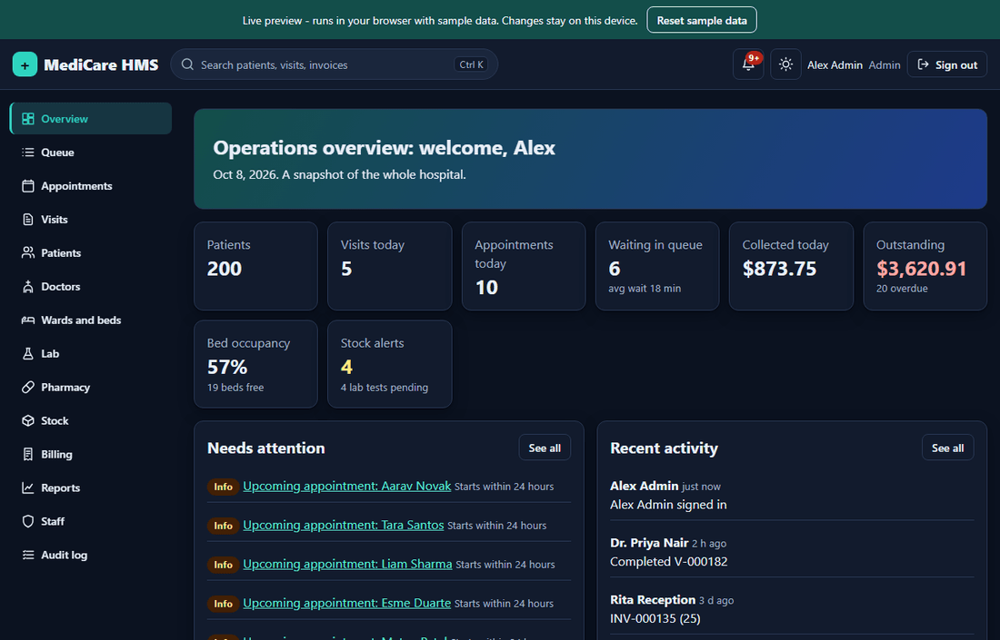 <br> Dark theme | 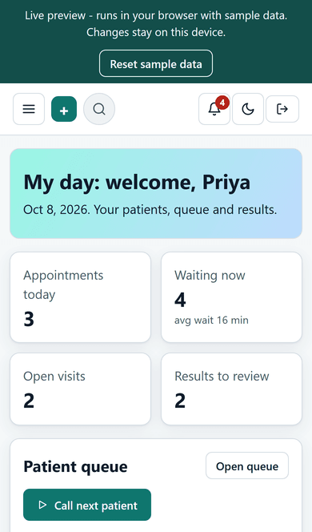 <br> Phone layout (320px and up) |

## What it does

- **Patients and doctors**: directory with search, record numbers (MRN), allergies, blood group, contacts; doctors with a weekly schedule (working days, hours, break, leave days), fee and room.
- **Appointments**: weekly agenda and searchable list, **overlap check** per doctor, availability warnings (leave, outside hours, break), **free slot suggestions**, statuses (scheduled, checked in, completed, cancelled, no-show), check-in that issues a queue token.
- **Outpatient queue (OPD)**: token numbers per day, routine/urgent/emergency priority, waiting time, call, start consult, skip, requeue; a large-token **display board** (`/display`) for the waiting room.
- **Triage and visits**: chief complaint, vitals (BP, pulse, temperature, SpO2, respiratory rate, weight, height, **BMI** and category), automatic flags and a suggested priority, consultation notes, diagnoses, follow-up, completion.
- **Prescriptions**: drug, dose, frequency, duration, instructions, **allergy alert** before issuing, printable prescription.
- **Pharmacy stock**: lots with expiry, reorder levels, receive and adjust stock, movement history, dispensing that **reduces stock first-expiry-first-out**, low-stock and expiry alerts.
- **Laboratory**: test catalogue with reference and critical ranges, orders (routine/urgent), sample collection, result entry with **abnormal/critical flags**, doctor review.
- **Billing**: invoices from a visit or admission or by hand, line items (consultation, procedure, lab, pharmacy, bed, other), discount (percent or amount), tax, **part payments**, paid / partial / overdue / void, receipts, printable invoice.
- **Wards and beds**: bed board, admit, transfer, discharge (with bed charges), cleaning and maintenance states, occupancy.
- **Reports**: daily visits, revenue (billed and collected), bed occupancy, top diagnoses, doctor workload.
- **Audit log**: who did what, when. **Notifications and reminders**: upcoming appointments, critical results, long waits, stock and expiry, overdue invoices.
- **Everywhere**: global search (**Ctrl+K**), CSV export, print stylesheets (prescription, invoice, receipt, patient summary), light and dark theme, skeletons, empty and error states, toasts, confirm dialogs, keyboard use, responsive from 320px, WCAG AA contrast.

Motion is limited to the landing/login hero (parallax and scroll-reveal using transform and opacity only). It switches off for reduced-motion users and on small screens, and is never applied to tables or forms.

## Roles

Six roles, one permission matrix. The first account registered on a fresh server becomes the admin; the admin creates the others. The matrix lives in [`shared/policy.js`](shared/policy.js) and is used by the API and by the live preview; a parity test fails if they ever disagree.

| Role | Home screen | Main menu |
|---|---|---|
| Admin | Operations overview | everything, plus Reports, Staff, Audit log |
| Doctor | My day | Queue, Visits, Patients, Appointments, Lab review, Wards |
| Nurse | Triage and wards | Queue (vitals), Visits, Wards and beds, Lab (collect samples), Patients |
| Receptionist | Front desk | Appointments, Queue tokens, Patients, Billing, Doctors, Wards (admit) |
| Pharmacist | Dispensing | Dispensing, Stock, Patients |
| Lab technician | Worklist | Lab (collect, results, catalogue), Patients |

<details>
<summary>Full permission matrix</summary>

| Area | Permission | Admin | Doctor | Nurse | Receptionist | Pharmacist | Lab tech |
|---|---|:-:|:-:|:-:|:-:|:-:|:-:|
| Patients | `patients.read` | yes | yes | yes | yes | yes | yes |
| Patients | `patients.create` | yes | - | yes | yes | - | - |
| Patients | `patients.update` | yes | - | yes | yes | - | - |
| Patients | `patients.remove` | yes | - | - | - | - | - |
| Doctors | `doctors.read` | yes | yes | yes | yes | yes | yes |
| Doctors | `doctors.manage` | yes | - | - | - | - | - |
| Doctors | `doctors.schedule` | yes | - | - | - | - | - |
| Staff | `users.manage` | yes | - | - | - | - | - |
| Appointments | `appointments.read` | yes | yes | yes | yes | yes | yes |
| Appointments | `appointments.write` | yes | - | - | yes | - | - |
| Appointments | `appointments.status` | yes | yes | yes | yes | - | - |
| Queue (OPD) | `queue.read` | yes | yes | yes | yes | - | - |
| Queue (OPD) | `queue.issue` | yes | - | yes | yes | - | - |
| Queue (OPD) | `queue.update` | yes | yes | yes | yes | - | - |
| Visits | `visits.read` | yes | yes | yes | - | - | - |
| Visits | `visits.create` | yes | yes | yes | - | - | - |
| Visits | `visits.vitals` | yes | yes | yes | - | - | - |
| Visits | `visits.consult` | yes | yes | - | - | - | - |
| Prescriptions | `prescriptions.read` | yes | yes | yes | - | yes | - |
| Prescriptions | `prescriptions.write` | yes | yes | - | - | - | - |
| Prescriptions | `pharmacy.dispense` | yes | - | - | - | yes | - |
| Pharmacy stock | `inventory.read` | yes | yes | yes | - | yes | - |
| Pharmacy stock | `inventory.manage` | yes | - | - | - | yes | - |
| Lab | `labs.catalog.read` | yes | yes | yes | yes | yes | yes |
| Lab | `labs.catalog.manage` | yes | - | - | - | - | - |
| Lab | `labs.read` | yes | yes | yes | - | - | yes |
| Lab | `labs.order` | yes | yes | - | - | - | - |
| Lab | `labs.collect` | yes | - | yes | - | - | yes |
| Lab | `labs.result` | yes | - | - | - | - | yes |
| Lab | `labs.review` | yes | yes | - | - | - | - |
| Billing | `billing.read` | yes | - | - | yes | - | - |
| Billing | `billing.write` | yes | - | - | yes | - | - |
| Billing | `billing.pay` | yes | - | - | yes | - | - |
| Billing | `billing.void` | yes | - | - | - | - | - |
| Wards and beds | `wards.read` | yes | yes | yes | yes | - | - |
| Wards and beds | `wards.manage` | yes | - | - | - | - | - |
| Wards and beds | `beds.status` | yes | - | yes | - | - | - |
| Wards and beds | `admissions.admit` | yes | yes | yes | yes | - | - |
| Wards and beds | `admissions.transfer` | yes | yes | yes | - | - | - |
| Wards and beds | `admissions.discharge` | yes | yes | - | - | - | - |
| Insight | `reports.read` | yes | - | - | - | - | - |
| Insight | `audit.read` | yes | - | - | - | - | - |
| Insight | `notifications.read` | yes | yes | yes | yes | yes | yes |
| Insight | `search.read` | yes | yes | yes | yes | yes | yes |
| Insight | `dashboard.read` | yes | yes | yes | yes | yes | yes |

</details>

### Sample accounts

Created by the seed script and used by the live preview (example.com addresses only). The login page of the preview has a collapsed *Preview accounts* helper whose *Fill form* buttons only fill the form.

| Role | Email | Password |
|---|---|---|
| Admin | admin@example.com | Admin@123 |
| Doctor | doctor@example.com | Doctor@123 |
| Nurse | nurse@example.com | Nurse@123 |
| Receptionist | receptionist@example.com | Reception@123 |
| Pharmacist | pharmacist@example.com | Pharmacy@123 |
| Lab technician | labtech@example.com | LabTech@123 |

Change or remove these accounts before exposing a real deployment.

## Architecture

```
shared/              framework-free code used by BOTH sides
  policy.js            the permission matrix (who may do what)
  domain.js            rules: vitals and BMI, lab flags, billing maths, stock (FEFO), queue, beds, slots, reports
  engine.js            request pipeline: route match, auth, permission, validation, audit, errors
  routes/              every endpoint (auth, directory, queue, visits, pharmacy, labs, billing, wards, insight)
  memoryStore.js       tiny in-memory document store with Mongo-style queries
  demoServer.js        the whole API running in the browser on that store
  seed.js              deterministic sample hospital (about 200 patients, 20 doctors, ...)
Backend/             Express 5 + Mongoose 9: HTTP adapter, JWT, rate limits, Mongo store, models, seed script
Frontend/            React 19 + Vite: role-aware UI; talks to the API or to the in-browser server
```

The handlers in `shared/routes` talk to a small async store interface. On the server it is backed by MongoDB (`Backend/store/mongoStore.js`), in the live preview by memory plus `localStorage`. Because the business rules exist once, the preview behaves like the real thing, and `Backend/test/flow.test.js` proves it by running the same clinical scenario against Express + MongoDB and against the preview engine and comparing every response status.

- **Real mode** (`npm run build`, default): the browser calls the REST API (`VITE_API_URL`).
- **Live preview** (`npm run build:pages`, `VITE_DEMO=true`): a HashRouter build with base `/Hospital-Management-Application/` that calls the in-browser server.
- **Security**: bcrypt passwords, JWT with `tokenVersion` (logout revokes every earlier token on all devices), disabled accounts lose access at once, per-IP request limit and a failed-login limiter, role checks on every route, request validation, audit trail.
- **Times** are stored in UTC. Working hours, "today" and day buckets use the browser's time zone (sent as a `tz` offset).

## Setup

Requirements: Node 24+, MongoDB 7 or newer (local or Docker).

```bash
npm install                      # repo root (concurrently)
cd Backend  && npm install && cp .env.example .env     # set JWT_SECRET to a long random string
cd ../Frontend && npm install
```

Seed the sample hospital (optional; without it, register the first admin on the login screen):

```bash
cd Backend
npm run seed                     # refuses to touch a database that already has users
npm run seed -- --reset          # wipe the hospital collections, then seed
```

Run both servers from the repo root:

```bash
npm run dev                      # API on :8080, UI on :5173
```

Browser-only preview of the same UI, no backend: `cd Frontend && npm run dev:demo`.

### Docker

```bash
cp .env.example .env             # set JWT_SECRET
docker compose up --build        # UI on http://localhost:8081, API on :8080
docker compose run --rm backend node scripts/seed.js    # load the sample hospital
```

Services: `mongo:8.0`, the Node 24 backend, and an nginx frontend that serves the build and proxies `/api` to the backend (one origin, no CORS setup).

### Scripts

| Where | Command | What |
|---|---|---|
| root | `npm run dev` | API and UI together |
| root | `npm test` | all backend, shared and frontend tests |
| Backend | `npm start` / `npm run dev` | run the API |
| Backend | `npm test` | domain, policy, API, flow, parity tests (needs a local MongoDB; uses a throwaway database) |
| Backend | `npm run seed` | sample data |
| Frontend | `npm run dev` / `dev:demo` | UI against the API / in-browser preview |
| Frontend | `npm run build` / `build:pages` | production build / GitHub Pages preview build |
| Frontend | `npm run lint` / `npm test` | ESLint (zero warnings) / Vitest |

## API overview

JSON over HTTP. Send `Authorization: Bearer <token>` (from `POST /auth/login`). Lists accept `?page&limit&search` and return `{ data, page, limit, total, pages }`. Errors are `{ "error": "message" }` with 400, 401, 403, 404, 409 or 429.

<details>
<summary>All endpoints and the permission each one needs</summary>

| Method | Path | Needs |
|---|---|---|
| GET | `/auth/status` | public |
| POST | `/auth/register` | public |
| POST | `/auth/login` | public |
| GET | `/auth/me` | any signed-in user |
| POST | `/auth/logout` | any signed-in user |
| GET | `/users` | `users.manage` |
| PATCH | `/users/:id` | `users.manage` |
| PUT | `/users/:id` | `users.manage` |
| DELETE | `/users/:id` | `users.manage` |
| GET | `/patients/lookup` | `patients.read` |
| GET | `/patients` | `patients.read` |
| POST | `/patients/add` | `patients.create` |
| PUT | `/patients/:id` | `patients.update` |
| PATCH | `/patients/:id` | `patients.update` |
| DELETE | `/patients/delete/:id` | `patients.remove` |
| GET | `/patients/:id` | `patients.read` |
| GET | `/patients/:id/history` | `appointments.read` |
| GET | `/patients/:id/summary` | `patients.read` |
| GET | `/doctors/lookup` | `doctors.read` |
| GET | `/doctors` | `doctors.read` |
| POST | `/doctors/add` | `doctors.manage` |
| PUT | `/doctors/:id` | `doctors.manage` |
| PATCH | `/doctors/:id` | `doctors.manage` |
| DELETE | `/doctors/delete/:id` | `doctors.manage` |
| GET | `/doctors/:id` | `doctors.read` |
| GET | `/doctors/:id/patient-history` | `appointments.read` |
| PUT | `/doctors/:id/schedule` | `doctors.schedule` |
| GET | `/doctors/:id/slots` | `appointments.read` |
| GET | `/appointments` | `appointments.read` |
| POST | `/appointments/add` | `appointments.write` |
| PUT | `/appointments/:id` | `appointments.write` |
| PATCH | `/appointments/:id` | `appointments.write` |
| PATCH | `/appointments/:id/status` | `appointments.status` |
| DELETE | `/appointments/delete/:id` | `appointments.write` |
| GET | `/queue` | `queue.read` |
| POST | `/queue/issue` | `queue.issue` |
| POST | `/appointments/:id/check-in` | `queue.issue` |
| POST | `/queue/:id/call` | `queue.update` |
| POST | `/queue/:id/start` | `queue.update` |
| POST | `/queue/:id/skip` | `queue.update` |
| POST | `/queue/:id/requeue` | `queue.update` |
| POST | `/queue/:id/cancel` | `queue.update` |
| PATCH | `/queue/:id` | `queue.update` |
| GET | `/visits` | `visits.read` |
| POST | `/visits` | `visits.create` |
| GET | `/visits/:id` | `visits.read` |
| PATCH | `/visits/:id/triage` | `visits.vitals` |
| PATCH | `/visits/:id/consult` | `visits.consult` |
| POST | `/visits/:id/complete` | `visits.consult` |
| POST | `/visits/:id/cancel` | `visits.create` |
| GET | `/prescriptions` | `prescriptions.read` |
| GET | `/prescriptions/:id` | `prescriptions.read` |
| POST | `/prescriptions` | `prescriptions.write` |
| POST | `/prescriptions/:id/cancel` | `prescriptions.write` |
| POST | `/prescriptions/:id/dispense` | `pharmacy.dispense` |
| GET | `/inventory` | `inventory.read` |
| GET | `/inventory/:id` | `inventory.read` |
| POST | `/inventory` | `inventory.manage` |
| PUT | `/inventory/:id` | `inventory.manage` |
| PATCH | `/inventory/:id` | `inventory.manage` |
| DELETE | `/inventory/:id` | `inventory.manage` |
| POST | `/inventory/:id/receive` | `inventory.manage` |
| POST | `/inventory/:id/adjust` | `inventory.manage` |
| GET | `/inventory/:id/movements` | `inventory.read` |
| GET | `/labs/tests` | `labs.catalog.read` |
| POST | `/labs/tests` | `labs.catalog.manage` |
| PUT | `/labs/tests/:id` | `labs.catalog.manage` |
| PATCH | `/labs/tests/:id` | `labs.catalog.manage` |
| DELETE | `/labs/tests/:id` | `labs.catalog.manage` |
| GET | `/labs/orders` | `labs.read` |
| GET | `/labs/orders/:id` | `labs.read` |
| POST | `/labs/orders` | `labs.order` |
| POST | `/labs/orders/:id/collect` | `labs.collect` |
| POST | `/labs/orders/:id/cancel` | `labs.order` |
| POST | `/labs/orders/:id/result` | `labs.result` |
| POST | `/labs/orders/:id/review` | `labs.review` |
| GET | `/invoices` | `billing.read` |
| GET | `/invoices/:id` | `billing.read` |
| POST | `/invoices` | `billing.write` |
| GET | `/billing/unbilled` | `billing.write` |
| POST | `/invoices/from-visit/:visitId` | `billing.write` |
| POST | `/invoices/from-admission/:admissionId` | `billing.write` |
| PUT | `/invoices/:id` | `billing.write` |
| PATCH | `/invoices/:id` | `billing.write` |
| POST | `/invoices/:id/payments` | `billing.pay` |
| POST | `/invoices/:id/void` | `billing.void` |
| GET | `/wards` | `wards.read` |
| POST | `/wards` | `wards.manage` |
| PUT | `/wards/:id` | `wards.manage` |
| PATCH | `/wards/:id` | `wards.manage` |
| DELETE | `/wards/:id` | `wards.manage` |
| POST | `/wards/:id/beds` | `wards.manage` |
| PUT | `/beds/:id` | `wards.manage` |
| PATCH | `/beds/:id` | `wards.manage` |
| PATCH | `/beds/:id/status` | `beds.status` |
| DELETE | `/beds/:id` | `wards.manage` |
| GET | `/admissions` | `wards.read` |
| POST | `/admissions` | `admissions.admit` |
| POST | `/admissions/:id/transfer` | `admissions.transfer` |
| POST | `/admissions/:id/discharge` | `admissions.discharge` |
| GET | `/reports/summary` | `reports.read` |
| GET | `/reports/daily-visits` | `reports.read` |
| GET | `/reports/revenue` | `reports.read` |
| GET | `/reports/bed-occupancy` | `reports.read` |
| GET | `/reports/top-diagnoses` | `reports.read` |
| GET | `/reports/doctor-workload` | `reports.read` |
| GET | `/audit` | `audit.read` |
| GET | `/notifications` | `notifications.read` |
| POST | `/notifications/read` | `notifications.read` |
| GET | `/search` | `search.read` |
| GET | `/dashboard` | `dashboard.read` |

</details>

## Quality checks

- Unit tests for billing maths, BMI, vitals and lab flags, bed occupancy, stock (FEFO and expiry), queue order, slot suggestion, reports and the permission matrix.
- API tests for auth, pagination, the overlap check, token revocation, rate limiting, staff management and validation.
- `flow.test.js`: one end-to-end clinical story (register, book, check in, triage, consult, prescribe, lab, dispense, bill, pay, admit, transfer, discharge) on Express + MongoDB **and** the preview engine, with identical results.
- `parity.test.js`: every guarded route is called as every role on both sides; the answer must be 403 exactly when the matrix says so.
- Browser tests (Playwright, Chromium, Firefox, WebKit, iPhone 13, Pixel 7) log in as every role, open every menu item and run the clinical flow; axe-core accessibility audits run per role in light and dark themes.

## Project structure

```
Backend/    app.js, server.js, middleware/, models/, store/, utils/, scripts/seed.js, test/
Frontend/   src/{api,components,context,hooks,lib,pages,ui}, vite.config.js, Dockerfile, nginx.conf
shared/     policy, domain rules, routes, engine, seed, tests
docs/       screenshots
docker-compose.yml
```

`Frontend/src/components` and `Frontend/src/CSS` hold the original first-version screens and are no longer used by the app.
